This is the R Notebook for the project from Sifeng Xu, 24525844 for unit *CITS4009 Computation Data Analysis*. It demonstrates the process and findings of EDA based on the **Countries and Death Causes** dataset. 

```{r setup, include=FALSE}
# Load  libraries
# library(shiny)
# library(shinyWidgets)
library(ggplot2)
library(gridExtra)
library(knitr)
library(dplyr)
library(fpc)
library('grDevices')


# load dataset
df_original <- read.csv("./Countries and death causes.csv",header = T, sep=",")

df <- df_original
years <- 1990:2019

count_nas <- function(data){
  count_missing <- function(data){
    sapply(data, FUN=function(col) sum(is.na(col)))
  }
  nacounts <- count_missing(data)
  hasNA = which(nacounts > 0)
  nacounts[hasNA]
}

count_null <- function(data){
  count_missing <- function(data){
    sapply(data, FUN=function(col) sum(col == ''))
  }
  nullcounts <- count_missing(data)
  hasNull = which(nullcounts > 0)
  nullcounts[hasNull]
}

count_negative <- function(data){
  count_missing <- function(data){
    sapply(data, FUN=function(col) sum(col < 0))
  }
  negcounts <- count_missing(data)
  hasNegative = which(negcounts > 0)
  negcounts[hasNegative]
}

dataUK <- df[df['Entity']=='United Kingdom',] #df[df['Entity']=='China',]
dataTAN <- df[df['Entity']=='Tanzania',]
dataNLD <- df[df['Entity']=='Netherlands',]
dataCAM <- df[df['Entity']=='Cambodia',]

```

### Basic information of the data


```{r glance, echo=TRUE}

data.frame(
  columeID = col(df)[1,],
  variables = names(df),
  class = sapply(df, typeof),
  first_values = sapply(df, function(x) paste0(head(x), collapse = ', ')),
  row.names = NULL) |>
kable()

summary(df) |> kable()

head(df) |> kable()

```


A first glance of data shows 31 columns which consists of 3 non-numerical data:

* countries' full name
* short country code
* year of measurements (1990-2019) 

the rest is numerical data showing how many deaths from each cause, each year and each country/region. Some countries are counted together such as *G20, OECD Countries, South-East Asia Region* and *Western Passific Region*. Also, some measured variables look similar such as *Outdoor.air.pollution, Household.air.pollution.from.solid.fuels* and *Air.pollution*.  


To give an impression what the dataset looks like, a snippet shows 6 countries and their deaths count from several causes in 2010.

```{r snippet, include=TRUE}
df_2010 <- df[df['Year']==2010, 
  c('Entity', 'Code', 'Outdoor.air.pollution','Child.wasting', 'Smoking', 'Drug.use')]
countries <- c('Afghanistan', 'Morocco', 'Nigeria', 'Australia', 'Belgium', 'Congo')
snippet <- subset(df_2010, Entity %in% countries)
names(snippet)[1] <- 'Country'
print(snippet)
```


### Histogram for single death cause

First check the data range by histogram. Variables that are linked to environment such as outdoor and household air quality tend to cause more deaths. This may prove that the long-term influence of poor air quality, which often sustains through a longer period, can kill many people living in that area/region.


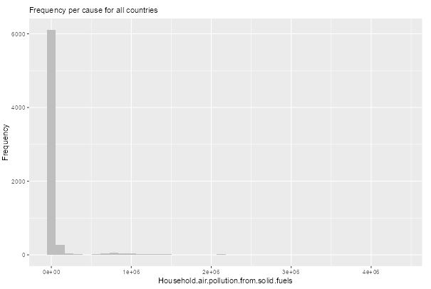

In contrast, causes such as *iron deficiency* and *vitamin A deficiency* lead to far less mortalities worldwide. Probably lack of iron or vitamin A alone is not too critical to the survival of most people.

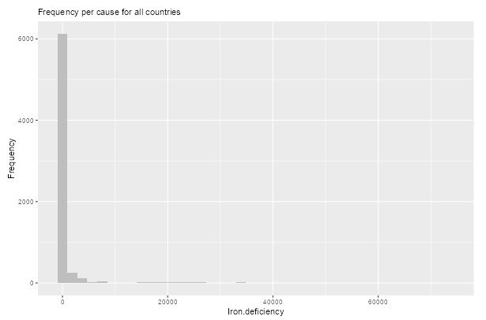


Across all variables, a fact is that high value of mortality does not appear often as most values seem to stay close to the lower boundary. Note a spike near zero for all example figures.

### Boxplot single

After comparing different countries with boxplot, it is noticeable that developed countries usually have less mortalities than developing countries in causes related to poor hygiene (e.g. water quality, unsafe sanitation and no access to hand washing facility). 

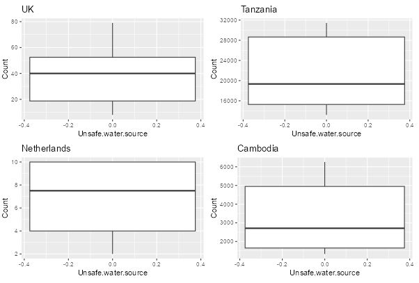


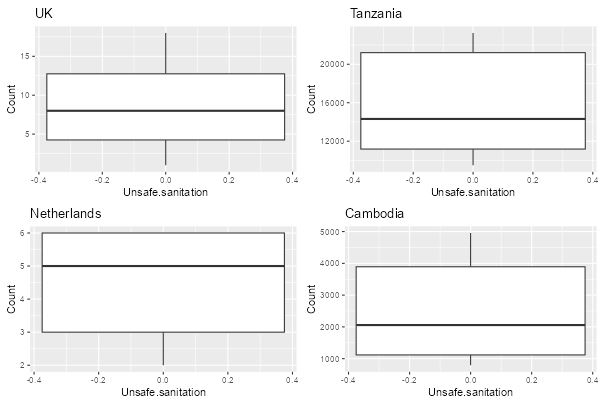


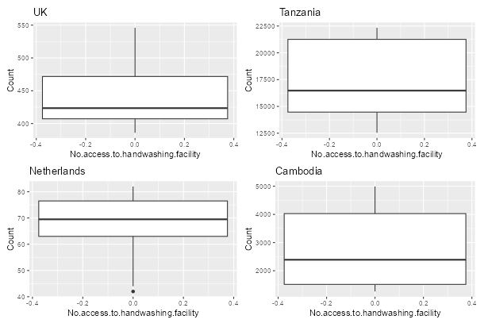  


Two pairs of countries are selected here as examples between *UK* and *Tanzania*, as well as *Netherlands* and *Cambodia*. The reason why they are compared to each other is because they share similar population according to [Worldometers](https://www.worldometers.info/world-population/population-by-country/).

### Trend comparison

Line graph shows the trend of certain causes from 1990 to 2019. Comparison between countries shows interesting facts.  Alcohol use seems to be more detrimental to people's health in recent years in both developed and developing countries selected in previous section. 

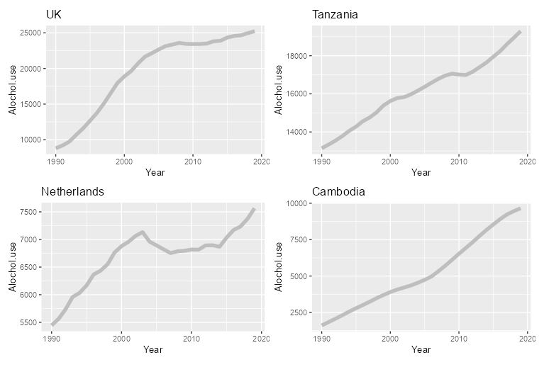

On the other hand, outdoor air pollution appears to become less harmful in western Europe than in Africa or Asia. This may have to do with the progress of industrialisation which leads to air pollution. In other words, Europe was almost at the end of it around the turn of the century. That is when they paid more attention to the environmental impacts. While certain areas in Africa and Asia just started to industrialise themselves. That is why the air quality got worse and worse in this period there.

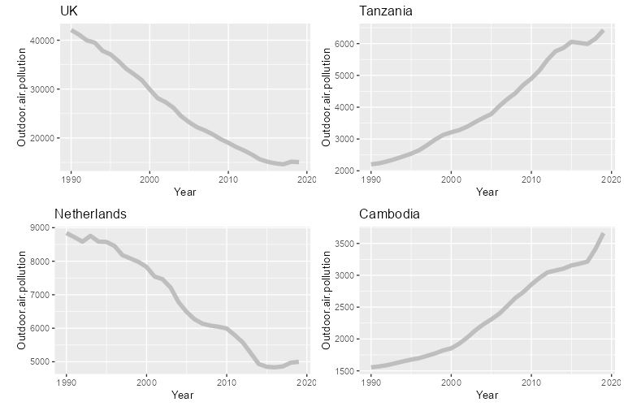

### Bar chart

Drug use seems to have serious impact in both rich and poor areas. In the figure below, far more people ended their life in India and the USA due to drug use than the whole African Region in 2010. European region is not much better as they ranked the third in this set of comparison worldwide. And the population of the whole EU was smaller than South-East Asia (top 1).

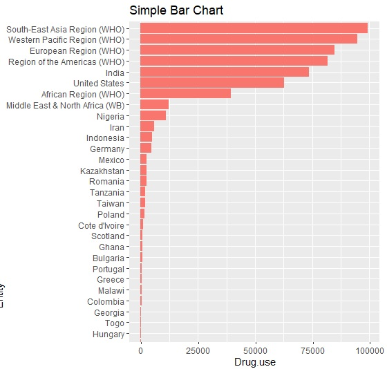

### Correlation between variables

When comparing multiple variables, it is clear that diet related death causes are  positive linear for African region. This may indicate the food security issue in this area.  On the other hand, this correlation seems less obvious for North America where the general public have much more dietary options.

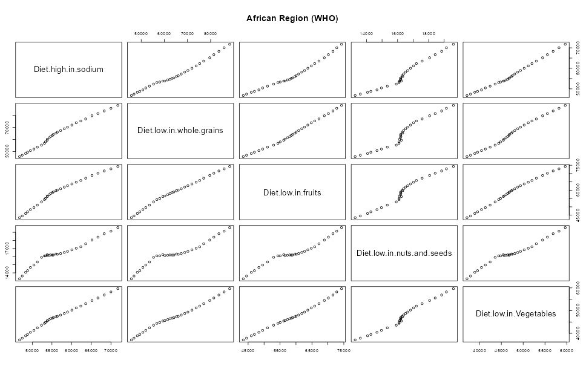

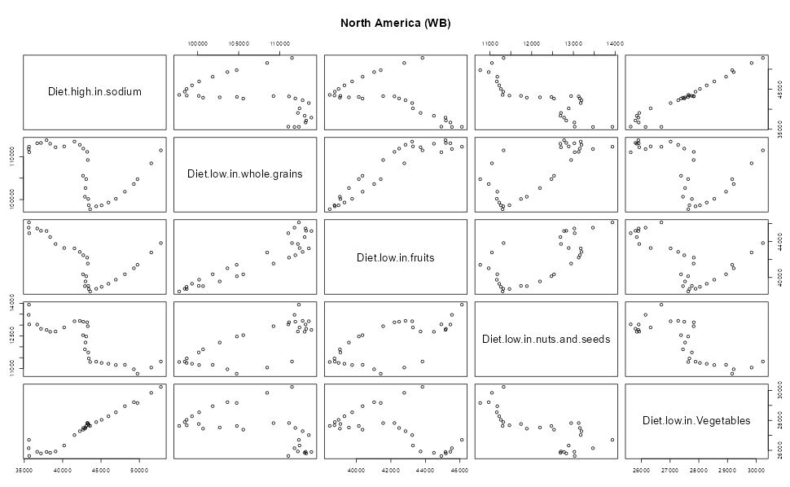

Smooth curve and jittering points shows drug use and unsafe sex clustering when sex fatality value is low. Once the value grows further they seem less correlated.

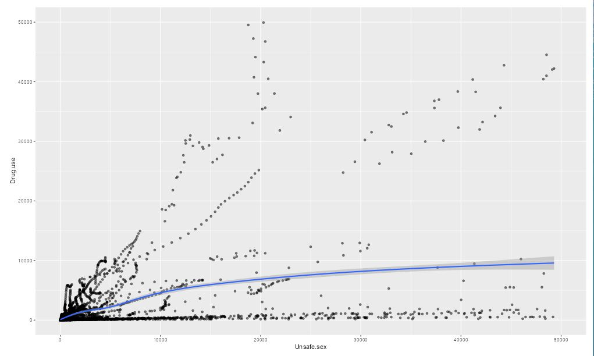

### Missing values and anomolies

All numerical variables are checked against: *NA, null, zeros* and *negative values*. 

```{r nas, echo=TRUE} 

numericVars <- names(df[, -c(1:3)]) # ignore Entity, Code and Year columns
df_num <- df[numericVars]

print(sum(is.na(df_num)))

print(sum(is.null(df_num)))

print(sum(df_num < 0))

print(sum(df_num == 0))
```

Currently there is no NA's in the dataset, neither are there any negative values. So this dataset looks quite clearn. In addition, there are zero values, which may indicate that either no one died of that specific cause in a country in a specific year, or they are missing values. Although it is possible to treat zero's as NA's and replace them with e.g. median or mean, doing this will overwrite all the zero's which are truly reflecting zero mortality. Therefore, in this project we will keep zero's as-is.

When checking the first three columns it shows that *Code* are empty in 690 rows. These appear to be specific to aggregated regions e.g. *OECD Countries* or regions within a country without a valid country code e.g. *Scotland*.

```{r rm_code, echo=TRUE}

count_empty <- function(data){
  count_missing <- function(data){
    sapply(data, FUN=function(col) sum(col == ''))
  }
  nullcounts <- count_missing(data)
  hasNull = which(nullcounts > 0)
  nullcounts[hasNull]
}

print(count_empty(df))
empty_rows <- df[df$Code == '', ]
print(empty_rows[sample(nrow(empty_rows), size = 6, replace = F), c(1:6)])
```

To make it easier to understand the sections below we rename *Entity* to *Country*. Also, because we will merge external data into this dataset based on country code, the aggregated regions will not be receiving any match. Therefore we would like to drop them now and keep only data per country for further study.

```{r rmcode}
colnames(df)[1] <- "Country"
df <- df[df$Code != '', ]
```


### Classfication 

We feel that the mortality count alone may not tell us much. So we would like to include country's total population to study death rates. Now we are going to merge the dataset as provided from [World Bank](https://data.worldbank.org/indicator/NY.GDP.PCAP.CD), and check missing values immediately.

```{r merge_gdp, echo=TRUE}
library(reshape2)

# merge total population 
popl <- read.table('./API_SP.POP.TOTL_DS2_en_csv_v2_31753/API_SP.POP.TOTL_DS2_en_csv_v2_31753.csv',header=T, sep=',')
colnames(popl) <- gsub("^X", "", colnames(popl))

popl <- popl[, c('Country.Code', years)]
popl_df <- melt(popl, id.vars = "Country.Code", variable.name = "Year", value.name = "total.population")
popl_df$Year <- as.numeric(as.character(popl_df$Year))
df_merged <- merge(df, popl_df, by.x = c("Code", "Year"), by.y = c("Country.Code", "Year"), all.x = TRUE)

df_merged <- df_merged[, c(1:3, ncol(df_merged)-1, ncol(df_merged), 4:(ncol(df_merged)-2))]

nacount <- count_nas(df_merged)
print(nacount)

nas_df_merged <- df_merged[is.na(df_merged$total.population),]
nas_df_merged[sample(nrow(nas_df_merged), 6), 1:5]

```

It appears that some islands and the total value of the whole world from the original death causes are also included which results in `r nacount` NA's in total population. This is only `r nacount/nrow(df_merged)*100`% of all dataset. Since we are only interested in studying individual countries it alright to drop them.

```{r drop_nas, echo=TRUE}

df_merged <- setdiff(df_merged, nas_df_merged)

# Our new dataset looks like:
df_merged[sample(nrow(df_merged), 6), 1:5]

```

Now that total population is merged and tidied up, we would like to know which death causes have large impact worldwide. Since the absolute number of mortality can vary largely depending on the population of a country, a better measurement is the percentage of each death cause, with respect to the total casualties in that row. 

We will first create a rate to count the percentage of each specific casualty cause. Then visualise the stats with boxplot to see the major players worldwide. Also *Country* and *Year* will be converted to factor.

```{r addCat, echo=TRUE}

df_merged$Country <- as.factor(df_merged$Country)
df_merged$Year <- as.factor(df_merged$Year)

df_merged$total.mortality <- rowSums(df_merged[numericVars])

for (col in numericVars) {
    df_merged[paste0(col, ".rate")] <- df_merged[col] / df_merged['total.mortality']
}

rateVars <- grep("\\.rate$", names(df_merged), value = TRUE)

figRateAll <- ggplot(stack(df_merged[rateVars])) + geom_boxplot(mapping = aes(x = ind, y = values)) + labs(x ='', y='Contribution of causes to total mortality') + coord_flip() 
# count the death rate of all causes with respect to the total population
df_merged$Death.rate <- (df_merged$total.mortality / df_merged$total.population)

print(figRateAll)

```

### Single variable prediction
It seems high blood pressure, smoking, high glucose rate and high BMI (obesity) are the top reasons to people's death. Now we would like to see what causes high death rate to a country. The rate is high (True) is if it is over the median rate worldwide. This binary variable holds the ground truth to check against the prediction later. 

Our hypothesis is that the higher percentage of the top death causes the more likely death rate will be high. So we will also derived binary values from *Unsafe.sex*, *High.blood.pressure* and *Smoking* to see if these death contribution is over their median values or not. 

Another reason to make extra binary variables is because so far there are only years and countries which can be converted to factors. We would like to combine a couple of extra categorical variables in our prediction. Variable *Code* is less self-explanatory than Country and therefore we will remove it. 

Now it is time to separate the data into training (81%), calibration(9%) and test (10%) data.

```{r get_train_cal_test, echo=TRUE}

df_merged$Code <- NULL

outcome <- c('Death.rate.high') # Smoking.kills.more, sodium.over.median
pos <- TRUE # positive value 

df_merged <- df_merged |>
  mutate(
    Death.rate.high = (Death.rate > median(Death.rate)),
    Unsafe.sex.over.median = (Unsafe.sex.rate > median(Unsafe.sex.rate)),
    Smoking.over.median = (Smoking.rate > median(Smoking.rate)),
    Blood.pressure.over.median = (High.systolic.blood.pressure.rate < median(High.systolic.blood.pressure.rate))
)

d <- df_merged

set.seed(729375)
d$rgroup <- runif(dim(d)[1])
dTrainAll <- subset(d, rgroup<=0.9)
dTest <- subset(d, rgroup>0.9)

# split dTrainAll into a training set and a validation (or calibration) set
useForCal <- rbinom(n=dim(dTrainAll)[1], size=1, prob=0.1)>0
dCal <- subset(dTrainAll, useForCal)
dTrain <- subset(dTrainAll, !useForCal)

```

The next step is to go through the categorical variables and see which one has the best prediction chance. Here the null model is saying the chance of our outcome variable being True will be the overall proportion of True values in the whole dataset, regardless what input it receives. Our goal is to find the single variable(s) that can help predict the result better than the null model does. 

```{r catVars_compare, echo=TRUE, warning=FALSE}

# names of columns that are categorical type and numerical type
vars <- setdiff(colnames(dTrainAll), c(outcome, 'rgroup'))
catVars <- vars[sapply(d[,vars], class) %in% c('character', 'logical',  'factor')]

mkPredC <- function(outCol, varCol, appCol) {
  pPos <- sum(outCol==pos)/length(outCol)
  naTab <- table(as.factor(outCol[is.na(varCol)]))
  pPosWna <- (naTab/sum(naTab))[pos]
  vTab <- table(as.factor(outCol), varCol)
  pPosWv <- (vTab[pos,]+1.0e-3*pPos)/(colSums(vTab)+1.0e-3)
  pred <- pPosWv[appCol]
  pred[is.na(appCol)] <- pPosWna
  pred[is.na(pred)] <- pPos
  pred
}

# now go through all the categorical variables in the `catVars` vector
# and perform the predictions. 
for (v in catVars) {
  pi <- paste('pred.', v, sep='')
  dTrain[,pi] <- mkPredC(dTrain[,outcome], dTrain[,v], dTrain[,v])
  dCal[,pi] <- mkPredC(dTrain[,outcome], dTrain[,v], dCal[,v])
  dTest[,pi] <- mkPredC(dTrain[,outcome], dTrain[,v], dTest[,v])
}

# Define a function to compute log likelihood so that we can reuse it.
logLikelihood <- function(ypred, ytrue) {
  sum(ifelse(ytrue, log(ypred), log(1-ypred)), na.rm=T)
}

# Compute the likelihood of the Null model on the calibration
pred.Null <- sum(dTrain[,outcome]==pos)/nrow(dTrain)
logNull <- logLikelihood(sum(dCal[,outcome]==pos)/nrow(dCal), dCal[,outcome]==pos)
cat("The log likelihood of the Null model is:", logNull)

selCatVars <- c()
minDrop <- -3

for (v in catVars) {
  pi <- paste('pred.', v, sep='')
  logPred <- logLikelihood(dCal[,pi], dCal[,outcome]==pos)
  cat(sprintf("%6s, log likelihood: %g\n", v, logPred))
  devDrop <- 2*(logPred - logNull)
  if (devDrop >= minDrop) {
    cat(sprintf("%6s, deviance reduction: %g\n", v, devDrop))
    selCatVars <- c(selCatVars, pi)
  }
}

devDrop <- 2*(logLikelihood(dCal[,outcome], dCal[,outcome]==pos) - logNull)
cat(sprintf("To compare, deviance reduction of the variable that we want to predict %6s is: %g\n", outcome, devDrop))

```

After checking the log likelihood and deviance reduction, no categorical or binary variables are doing a great job. Let is check how they perform in the ROC curve.

```{r roc_curve, echo=TRUE}
library(ROCit)

# colour_id 1-7 are: black,red,green,blue,cyan,purple,gold
plot_roc <- function(predcol, outcol, colour_id=2, overlaid=F) {
  ROCit_obj <- rocit(score=predcol, class=outcol==pos)
  par(new=overlaid)
  plot(ROCit_obj, col = c(colour_id, 1),
  legend = FALSE, YIndex = FALSE, values = FALSE)
}

print(selCatVars)

plot_roc(dCal[[selCatVars[1]]], dCal[,outcome]) #First variable is red
plot_roc(dCal[[selCatVars[2]]], dCal[,outcome], colour_id=3, overlaid=T) # Second variable is green
plot_roc(dCal[[selCatVars[3]]], dCal[,outcome], colour_id=4, overlaid=T)
```

Their AUC values are not higher than the null model. This is the confirmation to their performance in log likelihood and deviance reduction.

Now we are going to see if numerical variables can do better. We will use all num vars for prediction of `r outcome`.

```{r selnumVar, echo=TRUE, warning=FALSE}
numericVars <- vars[sapply(d[,vars], class) %in% c('numeric','integer')]

# get all percentage / rate variables 
rateVars <- grep("\\.rate$", numericVars, value = TRUE)

mkPredN <- function(outCol, varCol, appCol) {
  cuts <- unique(as.numeric(
    quantile(varCol, probs=seq(0, 1, 0.1), na.rm=T)))
  varC <- cut(varCol, cuts)
  appC <- cut(appCol, cuts)
  mkPredC(outCol, varC, appC)
}

# now go through all numerical variables in the `numericVars` vector and perform the predictions.
for (v in numericVars) {
  pi <- paste('pred.', v, sep='')
  dTrain[,pi] <- mkPredN(dTrain[,outcome], dTrain[,v], dTrain[,v])
  dTest[,pi] <- mkPredN(dTrain[,outcome], dTrain[,v], dTest[,v])
  dCal[,pi] <- mkPredN(dTrain[,outcome], dTrain[,v], dCal[,v])
}

# selNumVars is a vector that keeps the names of the top performing numerical variables.
selNumVars <- c()
minDrop <- 0

for (v in numericVars) {
  pi <- paste('pred.', v, sep='')
  logPred <- logLikelihood(dCal[,pi], dCal[,outcome]==pos)
  
  devDrop <- 2*(logPred - logNull)
  if (devDrop >= minDrop) {
    cat(sprintf("%6s, deviance reduction: %g\n", v, devDrop))
    selNumVars <- c(selNumVars, pi)
  }
}

```

The `r selNumVars` seems to be useful in reducing deviance, especially `r selNumVars[2]` which is doing extremely well. Let us see how it performs using AUC in calibration and test data set. We will also check the result with 100 fold cross-validation.

```{r evaluate, echo=TRUE}
library(ROCR)
calcAUC <- function(ypred, ytrue) {
    perf <- performance(prediction(ypred, ytrue), 'auc')
    as.numeric(perf@y.values)
}

# selVars <- c(selCatVars, selNumVars)
selVars <- c()

## Performance of the top performing single variables on the test set:
for(v in c(selCatVars, selNumVars)) {
  pi <- v
  aucTrain <- calcAUC(dTrain[,pi], dTrain[,outcome])
  if (aucTrain > 0.52) {
    selVars <- c(selVars, pi)
    aucCal <- calcAUC(dCal[,pi], dCal[,outcome])
    print(sprintf(
      "%s: trainAUC: %4.3f; calibrationAUC: %4.3f",
      pi, aucTrain, aucCal))
  } 
}

# Run 100-fold cross validation
original_vars <- character() #sub("^pred\\.", "", selVars)
# cat("Performance of the top performing single variables on the test set:")

for (v in selVars) {
  # retrieve the original variable name (character location 6 onward)
  orig_v <- substring(v, 6)
  original_vars <- c(original_vars, orig_v)
  cat(sprintf("In dTest Variable %6s: AUC = %g\n", orig_v, calcAUC(dTest[,v], dTest[,outcome]==pos)))
}

for (var in original_vars) {
  aucs <- rep(0,100)
  for (rep in 1:length(aucs)) {
    useForCalRep <- rbinom(n=nrow(dTrainAll), size=1, prob=0.1) > 0
    predRep <- mkPredC(dTrainAll[!useForCalRep, outcome],
    dTrainAll[!useForCalRep, var],
    dTrainAll[useForCalRep, var])
    aucs[rep] <- calcAUC(predRep, dTrainAll[useForCalRep, outcome])
  }
  print(sprintf("In dTrainAll %s: mean AUC: %4.3f; sd: %4.3f", var, mean(aucs), sd(aucs)))
}
# 
# print(selVars)
# print(original_vars)

```

After inspecting the selected variables a bit more, it seems `r original_vars[1]` works very well in training and calibration dataset, but not so well in the test data. Now visualise the ROC curve for the 2 variables.

```{r roc_selNumVars, echo=TRUE}
# colour_id 1-7 are: black,red,green,blue,cyan,purple,gold
plot_roc(dCal$pred.total.population, dCal[,outcome], colour_id=3) # population is green
plot_roc(dCal$pred.Unsafe.sanitation, dCal[,outcome], colour_id=4, overlaid=T) #  sanitation is blue

```

It is clear that total population (green) covers a larger area. Let us check the double density plot before drawing conclusion on which numerical variable is the best.

```{r double_density_cat, echo=TRUE}

fig1 <- ggplot(dCal) + geom_density(aes(x=pred.total.population, color=as.factor(Death.rate.high)))

fig2 <- ggplot(dCal) + geom_density(aes(x=pred.Unsafe.sanitation, color=as.factor(Death.rate.high)))

grid.arrange(fig1, fig2, ncol=1)

```

The peaks for `r selNumVars[1]` are a bit further away between TRUE and FALSE. When `r selNumVars[1]` is 0.5 the outcome will likely be False. When it becomes larger than 0.6 more `r outcome` will be True. This separation helps more in prediction. 

In contrast, the peaks of `r selNumVars[2]` for True/False are only marginally separated. It gets harder to see when either binary value will more likely to appear. Therefore in this round of comparison `r selNumVars[1]` seems a better choice.

In conclusion, both numerical variables selected seems to give reasonable predictions, only that one would perform better than the other depending on the measurement. To be honest, the `r selNumVars[2]` was not expected to be helpful in our prediction in the beginning. Also, three binary variables derived from the big contributors of death cause, which we expected to be strongly correlated with our outcome variable do not help much. 

Our interpretation is that the higher the population the higher death rate will likely be. This may reflect the fact that developing countries have more population than highly developed countries, which have better livability and people there tend to live longer. 

Next to that, safe sanitation seems to be crucial. This is more about washing hands, clean environment and hygiene, which are among the very basic standards of living. If these basic needs are not met, then many other things can go wrong which can put people's health and life at risk. 

According to [WHO stats on 2019](https://ourworldindata.org/grapher/mortality-rate-attributable-to-wash#:~:text=Death%20rate%20attributed%20to%20unsafe,people%20of%20a%20given%20population), the higher death rate by unsafe water, sanitation and lack of hygiene comes mostly from developing countries in Africa, Asia and South America. 


We will take these selected feature variables into the next round, feed them to multi-variate models to see if using multiple rather than single can do a better job. 

## Naive Bayers model

We will now put the `r selNumVars` in Naive Nayers model for prediction.

```{r run_nb_numvars, echo=TRUE, warning=FALSE}

run_nbPred <- function(outcome, selVars){

  pPos <- sum(dTrain[,outcome]==pos)/length(dTrain[,outcome])
  
  nBayes <- function(pPos, pf) {
    pNeg <- 1 - pPos
    smoothingEpsilon <- 1.0e-5
    scorePos <- log(pPos + smoothingEpsilon) +
      rowSums(log(pf/pPos + smoothingEpsilon))
    scoreNeg <- log(pNeg + smoothingEpsilon) +
      rowSums(log((1-pf)/(1-pPos) + smoothingEpsilon))
    m <- pmax(scorePos, scoreNeg)
    expScorePos <- exp(scorePos-m)
    expScoreNeg <- exp(scoreNeg-m)
    expScorePos/(expScorePos+expScoreNeg)
  }
  
  dTrain$nbpredl <- nBayes(pPos, dTrain[,selVars])
  dCal$nbpredl <- nBayes(pPos, dCal[,selVars])
  dTest$nbpredl <- nBayes(pPos, dTest[,selVars])
  
  # it seems the nbpredl has still NaN values. We will impute them with the median
  dTrain <- dTrain %>%
    mutate(nbpredl = ifelse(is.na(nbpredl), median(nbpredl, na.rm = TRUE), nbpredl))
  dCal <- dCal %>%
    mutate(nbpredl = ifelse(is.na(nbpredl), median(nbpredl, na.rm = TRUE), nbpredl))
  dTest <- dTest %>%
    mutate(nbpredl = ifelse(is.na(nbpredl), median(nbpredl, na.rm = TRUE), nbpredl))
  
  cat('Input variables are:', selVars, '\n')
  cat('The AUC value for the training set is:', calcAUC(dTrain$nbpredl, dTrain[,outcome]==pos), '\n')
  #The AUC value for the training set for uws and hapfsf is: 0.5575
  
  cat('The AUC value for the calibration set is:', calcAUC(dCal$nbpredl, dCal[,outcome]==pos), '\n')
  
  cat('The AUC value for the test set is:', calcAUC(dTest$nbpredl, dTest[,outcome]==pos))
}

#include also in NB model
selVars <- selNumVars #c(selCatVars, selNumVars[2])
run_nbPred(outcome, selVars)

```
In the single variable prediction `r selNumVars[1]` has AUC:

+ 0.533 for training
+ 0.571 for calibration 
+ 0.529 for test. 

`r selNumVars[2]` has AUC

+ 0.558 for training, 
+ 0.545 for calibration 
+ 0.493 for test. 

Naive Bayers does give a slightly better result than each numeric variables alone. Let's see if the categorical variables can predict more accurately.

```{r run_nb_catvars, echo=TRUE, warning=FALSE}
selVars <- selCatVars
run_nbPred(outcome, selVars)
```

Similar to what we noticed earlier, these variables do not really contribute to better prediction. Naive Bayers model is useful for predictions with many input variables and categorical variables with many levels. Since our categorical variables only contain 2 values true/false, they don't really improve the performance. We going to try again with *Country* and *Year* as extra categorical variables.

```{r run_nb_all_catvars, echo=TRUE, warning=FALSE}
selVars <- c(selVars, 'pred.Country', 'pred.Year')
run_nbPred(outcome, selVars)
```

Note the AUC score is getting better. Now run NB model with all selected categorical and top performing numerical variables.

```{r run_nb_all_vars, echo=TRUE, warning=FALSE}
selVars <- c(selVars, selNumVars)
run_nbPred(outcome, selVars)
```

It has become 0.6 which is better than the combination of all categorical variables. It is also better than each top performing numerical variables `r selNumVars` alone.

## Decision tree model

We will place the same set of variables from Naive Bayers in the decision tree model using *rpart*, excluding *Country* and *Year* which do not seem to be helpful.

```{r decision_tree_cat_num, echo=TRUE}
library(rpart)
library(rpart.plot)

selVars <- c(selCatVars, selNumVars)

fV <- paste(outcome, '>0 ~ ', paste(selVars, collapse=' + '), sep='')
print(fV)

tmodel <- rpart(formula = fV, data=dTrain)
print(calcAUC(predict(tmodel, newdata=dTrain), dTrain[,outcome]))
## [1] 0.705922 all vars, excluding Year and Country
print(calcAUC(predict(tmodel, newdata=dTest), dTest[,outcome]))
## [1] 0.6825181
print(calcAUC(predict(tmodel, newdata=dCal), dCal[,outcome]))
## [1] 0.6935539

rpart.plot(tmodel)

```

This is a much better outcome than the Naive Bayers, reaching 0.70 for training dataset with nearly consistent performance for calibration and test sets.

Now include the *Country* and *Year* to see if there are any improvements.

```{r decision_tree_all, echo=TRUE}
selVars <- c(selCatVars, 'pred.Country', 'pred.Year', selNumVars)

fV <- paste(outcome, '>0 ~ ', paste(selVars, collapse=' + '), sep='')
print(fV)

tmodel <- rpart(formula = fV, data=dTrain)
print(calcAUC(predict(tmodel, newdata=dTrain), dTrain[,outcome]))
## [1] 0.8154 all vars including Year and Country
print(calcAUC(predict(tmodel, newdata=dTest), dTest[,outcome]))
## [1] 0.8118
print(calcAUC(predict(tmodel, newdata=dCal), dCal[,outcome]))
## [1] 0.8125

rpart.plot(tmodel)

```

The AUC increases to over 0.81 across training, calibration and test data. This is the highest score so far which is way better than single variable and Naive Bayers. 

Our interpretation is that the 

## Clustering

We would like to pick 8 major contributors to people's death, as shown in the figure of Contribution of causes to total mortality, as input variables to our clustering. As the total number of countries (>200) is too large for visualising hierarchical structure, we will only use 30 of them. Moreover, we would like to focus on year 2000 where the turning of century takes place.

```{r hier_cluster, echo=TRUE}
# cols_to_remove <- grep("rate", names(df_merged), value = TRUE)
# # Identify logical columns
# logical_cols <- sapply(df_merged, is.logical)
# # Remove 'rate' columns, ignoring logical columns
# df_cleaned <- df_merged[, !(names(df_merged) %in% cols_to_remove | logical_cols)]
# df_cleaned <- df_cleaned[-c(1,2)]
set.seed(123)
uCons <- unique(df_merged$Country)

clusterSet <- df_merged[df_merged$Year == 2000, ] # as.numeric(as.character(

clusterSet <- clusterSet[sample(length(uCons), size = 25, replace = F), ]

vars.to.use <- c('Diet.low.in.whole.grains.rate', 'Diet.low.in.fruits.rate', 'Diet.low.in.Vegetables.rate', 'Diet.low.in.nuts.and.seeds.rate', 'Diet.high.in.sodium.rate')

# vars.to.use <- c('High.systolic.blood.pressure', 'Smoking', 'High.fasting.plasma.glucose', 'High.body.mass.index', 'Air.pollution', 'Alochol.use', 'Unsafe.sex', 'Low.birth.weight', 'total.population')

scaled_df <- scale(clusterSet[, vars.to.use]) # this is a matrix 

# The scaled:center attribute contains the mean values of all the columns.
print(attr(scaled_df, "scaled:center"))
# The scaled:scale attribute contains the variances of all the columns.
print(attr(scaled_df, "scaled:scale"))

d <- dist(scaled_df, method="euclidean")
pfit <- hclust(d, method="ward.D2")

# To examine `pfit`, type: summary(pfit) and pfit$height
plot(pfit, labels=clusterSet$Country, main="Dendrogram for Diet Related Causes")
rect.hclust(pfit, k=5) # k=5 means we want rectangles to be put around 5 clusters
xx <- c(1, 7, 12, 19, 22)
yy <- -4.5
clusterID <- c(2,3,1,5,4)
text(xx, yy, clusterID, col="red")
```

On this cluster dendrogram some countries within the same cluster are geographically close to each other. For example, in cluster 2 South Africa, Tanzania and Mali are all in Africa. In cluster 3, Denmark and Belgium are two European countries. In cluster 5, Serbia and Croatia are neighbors. In cluster 1, Tuvalu, Solomon Islands, Samoa and Vanuatu are all countries with islands in Oceania. 

Our interpretation is that countries that are close to each other share similar dietary habits, and therefore mortality rate of diet related causes are similar too. This clustering does show some pattern, although we are not sure yet if $k=5$ is the best option. Now we will visualise the clusters with 2 principle components.  

```{r cutree, include=FALSE}
d <- dist(scaled_df, method="euclidean")

groups <- cutree(pfit, k=5)
# print(groups)

print_clusters <- function(df, groups, cols_to_print) {
  Ngroups <- max(groups)
  for (i in 1:Ngroups) {
    print(paste("cluster", i))
    print(df[groups == i, cols_to_print])
  }
}

cols_to_print <- c("Country",'Diet.low.in.fruits.rate', 'Diet.low.in.Vegetables.rate','Diet.low.in.whole.grains.rate')
print_clusters(clusterSet, groups, cols_to_print)
```

```{r plot_cluster, echo=TRUE}
# Calculate the principal components of scaled_df
princ <- prcomp(scaled_df) 
nComp <- 2 # focus on the first two principal components

# project scaled_df onto the first 2 principal components to form a new
# 2-column data frame.
project2D <- as.data.frame(predict(princ, newdata=scaled_df)[,1:nComp])

# combine with `groups` and clusterSet$Country to form a 4-column data frame
hclust.project2D <- cbind(project2D, cluster=as.factor(groups), country=clusterSet$Country)

# finding convex hull
find_convex_hull <- function(proj2Ddf, groups) {
  do.call(rbind,
          lapply(unique(groups),
                 FUN = function(c) {
                   f <- subset(proj2Ddf, cluster==c);
                   f[chull(f),]
                 }
          )
  )
}
hclust.hull <- find_convex_hull(hclust.project2D, groups)

fig_hclust <- ggplot(hclust.project2D, aes(x=PC1, y=PC2)) +
  geom_point(aes(shape=cluster, color=cluster)) +
  geom_text(aes(label=country, color=cluster), hjust=0, vjust=1, size=3) +
  geom_polygon(data=hclust.hull, aes(group=cluster, fill=as.factor(cluster)),
               alpha=0.4, linetype=0) + theme(text=element_text(size=20))

print(fig_hclust)

```
Notice group 1, 2 and 4 are quite separated from each other while 3 and 5 seems to be close or even intersecting each other. Probably $k=5$ is not the best option.

Now it is time to use measurements to see if we can spot a better k. We will use within sum of squares (WSS), total sum of squares (TSS), between sum of squares (BSS) to calculate Calinski-Harabasz index (CH index) 

```{r clusterboot, include=FALSE}
kbest.p <- 5
cboot.hclust <- clusterboot(scaled_df, clustermethod=hclustCBI,
                            method="ward.D2", k=kbest.p)

#print(summary(cboot.hclust$result))

groups.cboot <- cboot.hclust$result$partition
print_clusters(clusterSet, groups.cboot, "Country")

# cboot.hclust$bootbrd = number of times a cluster is dissolved.
values <- 1 - cboot.hclust$bootbrd/100 # large values here => highly stable
print(values)
## [1] 0.75 0.79 0.52 0.75 0.60
cat("So clusters", order(values)[5], "and", order(values)[4], "are highly stable")
```

```{r sel_k, echo=TRUE}
sqr_euDist <- function(x, y) {
  sum((x - y)^2)
}

# Function to calculate WSS of a cluster, represented as a n-by-d matrix
# (where n and d are the numbers of rows and columns of the matrix)
# which contains only points of the cluster.
wss <- function(clustermat) {
  c0 <- colMeans(clustermat)
  sum(apply( clustermat, 1, FUN=function(row) {sqr_euDist(row, c0)} ))
}

# Function to calculate the total WSS. Argument `scaled_df`: data frame
# with normalised numerical columns. Argument `labels`: vector containing
# the cluster ID (starting at 1) for each row of the data frame.
wss_total <- function(scaled_df, labels) {
  wss.sum <- 0
  k <- length(unique(labels))
  for (i in 1:k)
    wss.sum <- wss.sum + wss(subset(scaled_df, labels == i))
  wss.sum
}

# Function to calculate total sum of squared (TSS) distance of data
# points about the (global) mean. This is the same as WSS when the
# number of clusters (k) is 1.
tss <- function(scaled_df) {
  wss(scaled_df)
}
# Function to return the CH indices computed using hierarchical
# clustering (function `hclust`) or k-means clustering (`kmeans`)
# for a vector of k values ranging from 1 to kmax.
CH_index <- function(scaled_df, kmax, method="kmeans") {
  if (!(method %in% c("kmeans", "hclust")))
    stop("method must be one of c('kmeans', 'hclust')")
  npts <- nrow(scaled_df)
  wss.value <- numeric(kmax) # create a vector of numeric type
  # wss.value[1] stores the WSS value for k=1 (when all the
  # data points form 1 large cluster).
  wss.value[1] <- wss(scaled_df)
  if (method == "kmeans") {
    # kmeans
    for (k in 2:kmax) {
      clustering <- kmeans(scaled_df, k, nstart=10, iter.max=100)
      wss.value[k] <- clustering$tot.withinss
    }
  } else {
    # hclust
    d <- dist(scaled_df, method="euclidean")
    pfit <- hclust(d, method="ward.D2")
    for (k in 2:kmax) {
      labels <- cutree(pfit, k=k)
      wss.value[k] <- wss_total(scaled_df, labels)
    }
  }
  bss.value <- tss(scaled_df) - wss.value # this is a vector
  B <- bss.value / (0:(kmax-1)) # also a vector
  W <- wss.value / (npts - 1:kmax) # also a vector
  data.frame(k = 1:kmax, CH_index = B/W, WSS = wss.value)
}

# calculate the CH criterion
crit.df <- CH_index(scaled_df, 10, method="hclust")

fig1 <- ggplot(crit.df, aes(x=k, y=CH_index)) +
  geom_point() + geom_line(colour="red") +
  scale_x_continuous(breaks=1:10, labels=1:10) +
  labs(y="CH index") + theme(text=element_text(size=20))
fig2 <- ggplot(crit.df, aes(x=k, y=WSS), color="blue") +
  geom_point() + geom_line(colour="blue") +
  scale_x_continuous(breaks=1:10, labels=1:10) +
  theme(text=element_text(size=20))

grid.arrange(fig1, fig2, nrow=1)

```

Given 25 countries selected randomly, the CH index has the highest value when $k=8$ which local maximum is alsos observed when $k=2$. Let us plot the hierarchical clustering again with this $k=8$.

```{r k_is_8, echo=TRUE}
plot(pfit, labels=clusterSet$Country, main="Dendrogram for Diet Related Deaths")
rect.hclust(pfit, k=8)
```

In this dendrogram the pattern is clearer than the previous one in that neighbour countries form separate clusters of their own. Serbia and Croatia, Vietnam and Japan (both from Asian), Armenia, Russian and Kazakhstan, three islands in Oceania. 

Let us compare the performance with kmeans clustering and see if the best k value changes.  

```{r kmeans, echo=TRUE, warning=FALSE}
# ----------------- Kmeans clustering -------------------
kbest.p <- 5
# run kmeans with 5 clusters, 100 random starts, and 100
# maximum iterations per run.
kmClusters <- kmeans(scaled_df, kbest.p, nstart=100, iter.max=100)

kmClustering.ch <- kmeansruns(scaled_df, krange=1:10, criterion="ch")

kmClustering.asw <- kmeansruns(scaled_df, krange=1:10, criterion="asw")


hclusting <- CH_index(scaled_df, 10, method="hclust")
cat("CH index from hclust for k=1 to 10:/n", hclusting$CH_index)

kmCritframe <- data.frame(k=1:10, ch=kmClustering.ch$crit,
                          asw=kmClustering.asw$crit)

fig1 <- ggplot(kmCritframe, aes(x=k, y=ch)) +
  geom_point() + geom_line(colour="red") +
  scale_x_continuous(breaks=1:10, labels=1:10) +
  labs(y="CH index") + theme(text=element_text(size=20))

fig2 <- ggplot(kmCritframe, aes(x=k, y=asw)) +
  geom_point() + geom_line(colour="blue") +
  scale_x_continuous(breaks=1:10, labels=1:10) +
  labs(y="ASW") + theme(text=element_text(size=20))
grid.arrange(fig1, fig2, nrow=1)

fig <- c()
kvalues <- c(2,5,6,8)
for (k in kvalues) {
  groups <- kmeans(scaled_df, k, nstart=100, iter.max=100)$cluster
  kmclust.project2D <- cbind(project2D, cluster=as.factor(groups),
                             country=df$Country)
  kmclust.hull <- find_convex_hull(kmclust.project2D, groups)
  assign(paste0("fig", k),
         ggplot(kmclust.project2D, aes(x=PC1, y=PC2)) +
           geom_point(aes(shape=cluster, color=cluster)) +
           geom_polygon(data=kmclust.hull, aes(group=cluster, fill=cluster),
                        alpha=0.4, linetype=0) +
           labs(title = sprintf("k = %d", k)) +
           theme(legend.position="none", text=element_text(size=20))
  )
}

grid.arrange(fig2, fig5, fig6, fig8, nrow=2)
```

Both CH index and average silhouette width (ASW) show a local maximum when $k=2$ and a highest value when $k=8$. This is in line with the observation from the hierarchical clustering. We can see in the visual comparison that clusters are farer apart from each other when $k=8$ than when k has other values.

### LIME evaluation 


