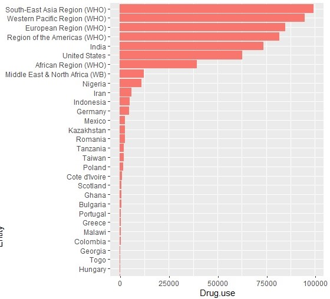

This is the R Notebook for the project from Sifeng Xu, 24525844 for unit *CITS4009 Computation Data Analysis*. It demonstrates the process and findings of EDA based on the **Countries and Death Causes** dataset. 

```{r setup, echo=FALSE}
# Load  libraries
library(shiny)
library(shinyWidgets)
library(ggplot2)
library(gridExtra)
library(knitr)

# load dataset
df <- read.csv("./Countries and death causes.csv",header = T, sep=",")

dataUK <- df[df['Entity']=='United Kingdom',] #df[df['Entity']=='China',]
dataTAN <- df[df['Entity']=='Tanzania',]
dataNLD <- df[df['Entity']=='Netherlands',]
dataCAM <- df[df['Entity']=='Cambodia',]

```

### Basic information of the data


```{r glance, echo=TRUE}

data.frame(
  columeID = col(df)[1,],
  variables = names(df),
  class = sapply(df, typeof),
  first_values = sapply(df, function(x) paste0(head(x), collapse = ', ')),
  row.names = NULL) |>
kable()

summary(df) |> kable()

head(df) |> kable()

```


A first glance of data shows 31 columns which consists of 3 non-numerical data:

* countries' full name
* short country code
* year of measurements (1990-2019) 

the rest is numerical data showing how many deaths from each cause, each year and each country/region. Some countries are counted together such as *G20, OECD Countries, South-East Asia Region* and *Western Passific Region*. Also, some measured variables look similar such as *Outdoor.air.pollution, Household.air.pollution.from.solid.fuels* and *Air.pollution*.  

Most variables have zero values. This indicates that either no one died of that specific cause in a country in a specific year, or they were just missing values. Furthermore, there is no NA's in the dataset. 

```{r nas, echo=TRUE} 
print(sum(is.na(df)))

```

To give an impression what the dataset looks like, a snippet shows 6 countries and their deaths count from several causes in 2010.

```{r snippet, include=TRUE}
df_2010 <- df[df['Year']==2010, 
  c('Entity', 'Code', 'Outdoor.air.pollution','Child.wasting', 'Smoking', 'Drug.use')]
countries <- c('Afghanistan', 'Morocco', 'Nigeria', 'Australia', 'Belgium', 'Congo')
snippet <- subset(df_2010, Entity %in% countries)
names(snippet)[1] <- 'Country'
print(snippet)
```


### Histogram for single death cause
```{r histsingle, include=FALSE}
# Define UI for application that draws a histogram
ui <- fluidPage(

    # Application title
    # titlePanel("Histgram for single death cause"),

    # Sidebar with a slider input for number of bins 
    sidebarLayout(
        sidebarPanel(
          selectInput(inputId = "x", label = "Choose death cause", choices = names(df[, -c(1:3)]))
        ),
        # Show a plot of the generated distribution
        mainPanel(
           plotOutput("histogram")
        )
    )
)

# Define server logic required to draw a histogram
server <- function(input, output) {
    generate_histogram <- function(data, var, title) {
      ggplot(data) +
        geom_histogram(aes_string(x = var), bins = 40, fill = "gray") +
        labs(title = title, x = var, y = "Frequency", subtitle = 'Frequency per cause for all countries')
    }
    # Render the side-by-side histograms
    output$histogram <- renderPlot({
      generate_histogram(df, input$x, colnames(input$var))
    })
}

# Run the application 
shinyApp(ui = ui, server = server)
```


First check the data range by histogram. Variables that are linked to environment such as outdoor and household air quality tend to cause more deaths. This may prove that the long-term influence of poor air quality, which often sustains through a longer period, can kill many people living in that area/region.


In contrast, causes such as *iron deficiency* and *vitamin A deficiency* lead to far less mortalities worldwide. Probably lack of iron or vitamin A alone is not too critical to the survival of most people.


Across all variables, a fact is that high value of mortality does not appear often as most values seem to stay close to the lower boundary. Note a spike near zero for all example figures.

### Boxplot single
```{r boxsingle, include=FALSE}
# Define UI for application that draws a plot
ui <- fluidPage(

    # Application title
    # titlePanel("Boxplot for single death cause per country"),

    # Sidebar with a slider input for number of bins 
    sidebarLayout(
        sidebarPanel(
          selectInput(inputId = "con", label = "Choose country", choices = unique(df$Entity)),
          selectInput(inputId = "var", label = "Choose death cause", choices = names(df[, -c(1:3)])),
        ),
        # Show a plot of the generated distribution
        mainPanel(
           plotOutput("boxplot")
        )
    )
)

# Define server logic required to draw a histogram
server <- function(input, output) {
  # Render the side-by-side histograms
  output$boxplot <- renderPlot({
    data <- df[df['Entity']==input$con,] #df[df['Entity']=='China',]
    boxplot(data[input$var], xlab=input$var, ylab = 'Count')
  })
}

# Run the application 
shinyApp(ui = ui, server = server)
```

After comparing different countries with boxplot, it is noticeable that developed countries usually have less mortalities than developing countries in causes related to poor hygiene (e.g. water quality, unsafe sanitation and no access to hand washing facility). 


Two pairs of countries are selected here as examples between the *Uk* and *Tanzania*, as well as the *Netherlands* and *Cambodia*. The reason why they are compared to each other is because counties in each pair shares similar population according to [Worldometers](https://www.worldometers.info/world-population/population-by-country/).

```{r boxcompare, include=FALSE}
# Define UI for application that draws a histogram
ui <- fluidPage(

    # Application title
    titlePanel("UK vs Tanzania | Netherlands vs Cambodia"),

    # Sidebar with a slider input for number of bins 
    sidebarLayout(
        sidebarPanel(
          selectInput(inputId = "var", label = "Choose death cause", choices = c('Unsafe.water.source', 'Unsafe.sanitation', 'No.access.to.handwashing.facility')),
        ),
        # Show a plot of the generated distribution
        mainPanel(
           plotOutput("boxplot")
        )
    )
)

# Define server logic required to draw a histogram
server <- function(input, output) {
  # Render the side-by-side histograms
  output$boxplot <- renderPlot({
    sel_var <- input$var
    
    p1 <- ggplot(dataUK) + geom_boxplot(aes_string(y=sel_var)) +
      labs(x = input$var, y= 'Count', title = 'UK')
    
    p2 <- ggplot(dataTAN) + geom_boxplot(aes_string(y=sel_var)) +
      labs(x = input$var, y= 'Count', title = 'Tanzania')
    
    p3 <- ggplot(dataNLD) + geom_boxplot(aes_string(y=sel_var)) +
      labs(x = input$var, y= 'Count', title = 'Netherlands')
    
    p4 <- ggplot(dataCAM) + geom_boxplot(aes_string(y=sel_var)) +
      labs(x = input$var, y= 'Count', title = 'Cambodia')
    
    grid.arrange(p1, p2, p3, p4, nrow=2)
  })
}

# Run the application 
shinyApp(ui = ui, server = server)
```

### Trend comparison
```{r linesingle, include=FALSE}
# Define UI for application that draws a histogram
ui <- fluidPage(

    # Application title
    # titlePanel("Trend for single death cause per country"),
    sidebarLayout(
        sidebarPanel(
          selectInput(inputId = "var", label = "Choose death cause", choices = names(df[, -c(1:3)])),
        ),
        # Show a plot of the generated distribution
        mainPanel(
           plotOutput("trendline")
        )
    )
)

# Define server logic required to draw a plot
server <- function(input, output) {
  # Render the side-by-side histograms
  output$trendline <- renderPlot({
    sel_var <- input$var
   
    p1 <- ggplot(dataUK, aes_string(x ='Year', y=sel_var)) + 
      geom_line(color='gray', size=2) + 
      labs(title = 'UK')
    
    p2 <- ggplot(dataTAN, aes_string(x ='Year', y=sel_var)) + 
      geom_line(color='gray', size=2) + 
      labs(title = 'Tanzania')
    
    p3 <- ggplot(dataNLD, aes_string(x ='Year', y=sel_var)) + 
      geom_line(color='gray', size=2) + 
      labs(title = 'Netherlands')
    
    p4 <- ggplot(dataCAM, aes_string(x ='Year', y=sel_var)) + 
      geom_line(color='gray', size=2) + 
      labs(title = 'Cambodia')
    
    grid.arrange(p1, p2, p3, p4, nrow=2)
    # ggplot(data, aes_string(x ='Year', y=sel_var)) + geom_line(color='gray', size=2)
  })
}

# Run the application 
shinyApp(ui = ui, server = server)
```

Line graph shows the trend of certain causes from 1990 to 2019. Comparison between countries shows interesting facts.  Alcohol use seems to be more detrimental to people's health in recent years in both developed and developing countries selected in previous section. 


On the other hand, outdoor air pollution appears to become less harmful in western Europe than in Africa or Asia. This may have to do with the progress of industrialisation which leads to air pollution. In other words, Europe was almost at the end of it around the turn of the century, and they paid more attention to the environmental impact. While certain areas in Africa and Asia just started to industrialize themselves. That is why the air quality got worse and worse in this period there.


### Bar chart

Drug use seems to have serious impact in both rich and poor areas. In the figure below, far more people ended their life in India and the USA due to drug use than the whole African Region in 2010. European region is not much better as they ranked the third in this set of comparison worldwide.



### Correlation between variables

When comparing multiple variables, it is clear that diet related death causes are  positive linear for African region. This may indicate the food security issue in this area.  On the other hand, this correlation seems less obvious for North America where the general public have much more dietary options.


Smooth curve and jittering points shows drug use and unsafe sex clustering when sex fatality value is low.  Once the value grows further they seemed less correlated.


```{r histdouble, include=FALSE}
ui <- fluidPage(

    # Application title
    titlePanel("Histogram within a country"),

    # Sidebar with a slider input for number of bins 
    sidebarLayout(
        sidebarPanel(
          selectInput(inputId = "con", label = "Choose country", choices = unique(df$Entity)),
          selectInput(inputId = "var1", label = "Choose death cause1", choices = names(df[, -c(1:3)])),
          selectInput(inputId = "var2", label = "Choose death cause2", choices = names(df[, -c(1:3)]))
        ),
        # Show a plot of the generated distribution
        mainPanel(
           plotOutput("histogram")
        )
    )
)

# Define server logic required to draw a histogram
server <- function(input, output) {
    generate_histogram <- function(data, con, x_var1, x_var2, title) {
      data <- data[data$Entity == con,]
      
      p1 <- ggplot(data, aes_string(x = x_var1)) +
        geom_histogram(bins = 20, fill = "gray") +
        labs(title = title, x = x_var1, y = "Frequency", subtitle = 'Frequency per cause per country')
      
      p2 <- ggplot(data, aes_string(x = x_var2)) +
        geom_histogram(bins = 20, fill = "gray") +
        labs(title = title, x = x_var2, y = "Frequency", subtitle = 'Frequency per cause per country')
      
      grid.arrange(p1, p2, nrow = 1)
    }
    # Render the side-by-side histograms
    output$histogram <- renderPlot({
      generate_histogram(df, input$con, input$var1, input$var2, colnames(input$var))
    })
}

# Run the application 
shinyApp(ui = ui, server = server)
```


