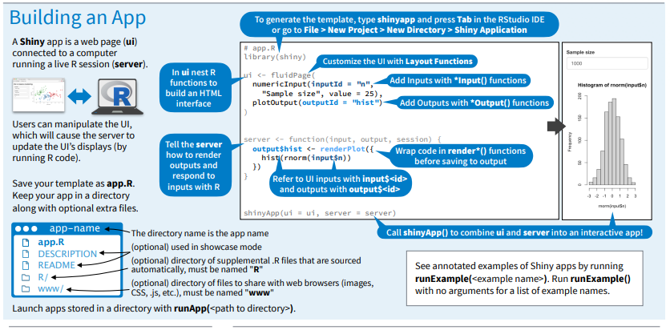

Mart down provides an easy way to make standard types of formatted text, like

-   *italics*
-   **bold**
-   `code`
-   [links](https://bookdown.org/yihui/rmarkdown-cookbook/bibliography.html)
-   image 

But did you know that you can also use R Markdown's markdown to make

-   Latex equations, $E = mc^{2}$
-   And bibliographies [@R-base]

## R Markdown

This is an R Markdown document. Markdown is a simple formatting syntax for authoring HTML, PDF, and MS Word documents. For more details on using R Markdown see <http://rmarkdown.rstudio.com>.

When you click the **Knit** button a document will be generated that includes both content as well as the output of any embedded R code chunks within the document. You can embed an R code chunk like this:

```{r include=FALSE}
knitr::opts_chunk$set(echo = FALSE)
```

```{r message=FALSE, warning=FALSE}
library(viridis)
```

The code below demonstrates the Magma palette in the [viridis](https://github.com/sjmgarnier/viridis) package. It displays a contour map of the Maunga Whau volcano in Auckland, New Zealand.

## Magma colors

```{r fig.cap= "The Mounga Whau volcano, Auckland."}
image(volcano, col = viridis(200, option="A"))
```

## More colours
```{r include=FALSE}
# colorFunc <- 'heat.colors'
# colorFunc <- 'terrain.colors'
colorFunc <- 'topo.colors'
# colorFunc <- 'cm.colors'
# colorFunc <- 'rainbow'
```
Base R comes with many functions for generating colors. The code below demonstrates the `r colorFunc` function.

## `r colorFunc`
```{r fig.cap= "The maunga Whau volcano.", echo=FALSE}
image(volcano, col = get(colorFunc)(200))
```

## Table options
Several packages support making beautiful tables with R, such as

* [xtable](https://www.google.com/maps)
* [stargazer](https://www.google.com/maps)
* [pander](https://www.google.com/maps)
* [tables](https://www.google.com/maps)
* [ascii](https://www.google.com/maps)
* etc.

It is also very easy to make tables with knitr's `kable` function:
```{r echo=FALSE, results= 'markup'}
library(knitr)
kable(mtcars[1:5, ], caption = "A knitr kable.")
```


## Including Plots

You can also embed plots, for example:

Note that the `echo = FALSE` parameter was added to the code chunk to prevent printing of the R code that generated the plot.
